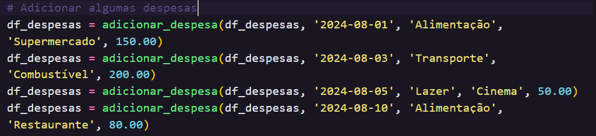
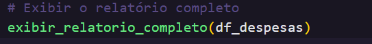
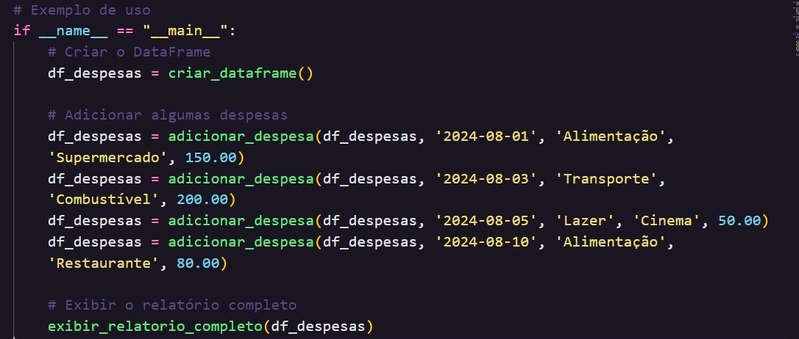
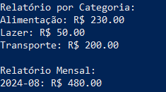

## Guia de Uso: Análise Financeira de Despesas Pessoais

### 1. Preparação do Ambiente

#### 1.1. Instalação de Python
##### Certifique-se de ter o Python 3.8 ou superior instalado em seu sistema. Você pode baixar o Python no site oficial: python.org.

#### 1.2. Instalação da Biblioteca Pandas
##### Este código utiliza a biblioteca Pandas para manipulação de dados. Para instalá-la, execute o seguinte comando no terminal:
##### >> pip install pandas

### 2. Executando o Código

#### 2.1. Passo a Passo
##### 1. Copie o código para um arquivo Python. Por exemplo, você pode salvar o código em um arquivo chamado app.py.
##### 2. Crie um DataFrame para armazenar as despesas:
##### A primeira etapa é criar um DataFrame vazio onde as despesas serão armazenadas.

##### 3. Adicione suas despesas:
##### Utilize a função adicionar_despesa para registrar cada despesa. Você deve fornecer a data, a categoria, uma breve descrição e o valor da despesa.

##### 4. Exiba os relatórios:
##### Após adicionar todas as suas despesas, utilize a função exibir_relatorio_completo para gerar e visualizar os relatórios por categoria e por mês.

#### 2.2. Exemplo Completo
##### Aqui está um exemplo completo de como usar o código:

#### 2.3. Saída Esperada
##### Ao executar o exemplo acima, você verá a seguinte saída:

##### 3. Dicas Úteis
##### Formatos de Data: Certifique-se de inserir as datas no formato YYYY-MM-DD para evitar erros ao adicionar despesas.
##### Categorias: Crie categorias que façam sentido para suas despesas (ex: Alimentação, Transporte, Lazer, Saúde) e use-as consistentemente.
##### Análise: Use os relatórios gerados para entender melhor onde você está gastando e identificar áreas para economizar.
